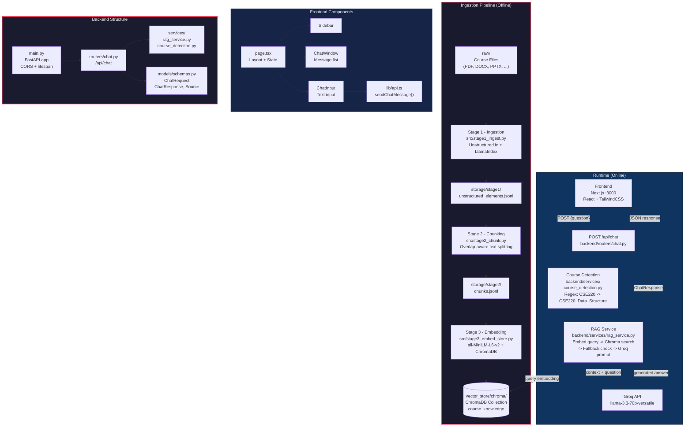

# UniBot - AI-Powered University Course Chatbot

UniBot answers student questions using local university course materials with a RAG (Retrieval-Augmented Generation) pipeline. The frontend keeps the chat simple: users only type a question. The backend detects course codes such as `CSE220`, `CSE 220`, `CSE-220`, or `HST103`, resolves them to the indexed Chroma metadata course name, and searches globally when no course is mentioned.

## Architecture



## Project Structure

```
AI-powered chatbot/
├── raw/                        # Course files (PDF, DOCX, PPTX...) - gitignored
├── storage/
│   ├── stage1/                 # Parsed elements (unstructured_elements.jsonl)
│   └── stage2/                 # Retrieval chunks (chunks.jsonl)
├── vector_store/
│   └── chroma/                 # ChromaDB persistent index - gitignored
├── src/                        # Ingestion pipeline modules
│   ├── ingestion/              # File discovery, loaders, settings
│   ├── stage1_ingest.py        # Stage 1: Parse raw files into elements
│   ├── stage2_chunk.py         # Stage 2: Split elements into chunks
│   ├── stage3_embed_store.py   # Stage 3: Embed + store in ChromaDB
│   ├── stage4_retrieval_test.py# Stage 4: CLI retrieval test
│   └── stage5_rag_answer_groq.py # Stage 5: CLI RAG answer test
├── backend/                    # FastAPI backend
│   ├── main.py                 # App entry, CORS, lifespan
│   ├── models/schemas.py       # Pydantic request/response models
│   ├── routers/chat.py         # POST /api/chat endpoint
│   └── services/
│       ├── rag_service.py      # RAG pipeline orchestration
│       └── course_detection.py # Course code detection + resolution
├── frontend/                   # Next.js frontend
│   ├── app/page.tsx            # Main page layout
│   ├── components/             # Sidebar, ChatWindow, ChatInput
│   ├── lib/api.ts              # Backend API client
│   └── types/                  # TypeScript type definitions
├── tests/                      # Test suite
├── requirements.txt            # Python dependencies
├── .env.example                # Environment variable template
└── README.md
```

## Pipeline Stages

| Stage | Module | Input | Output | Description |
|-------|--------|-------|--------|-------------|
| 1 - Ingestion | `src/stage1_ingest.py` | `raw/` course files | `storage/stage1/unstructured_elements.jsonl` | Parses PDFs, DOCX, PPTX using Unstructured.io and LlamaIndex |
| 2 - Chunking | `src/stage2_chunk.py` | Stage 1 JSONL output | `storage/stage2/chunks.jsonl` | Overlap-aware text splitting with metadata preservation |
| 3 - Embedding | `src/stage3_embed_store.py` | Stage 2 chunks | `vector_store/chroma/` | Embeds with `all-MiniLM-L6-v2`, stores in ChromaDB |
| 4 - Retrieval Test | `src.stage4_retrieval_test.py` | CLI query | Console output | Verifies vector search from the command line |
| 5 - RAG Answer | `src.stage5_rag_answer_groq.py` | CLI query | Console / JSON | Full RAG pipeline: retrieve + Groq generation |
| 6 - Backend/Frontend | `backend/` + `frontend/` | User question via UI | Chat response | Exposes `POST /api/chat`, displays answers + sources |

## Setup

### Prerequisites

- Python 3.10+
- Node.js 18+
- A Groq API key (free tier available at [console.groq.com](https://console.groq.com))

### Installation

```powershell
# Clone and set up Python environment
python -m venv .venv
.\.venv\Scripts\Activate.ps1
pip install -r requirements.txt

# Set up frontend
cd frontend
npm install
cd ..
```

### Environment Configuration

```powershell
Copy-Item .env.example .env
```

Edit `.env` with your Groq API key:

```env
GROQ_API_KEY="your_groq_api_key_here"
GROQ_MODEL="llama-3.3-70b-versatile"
CHROMA_DIR="vector_store/chroma"
CHROMA_COLLECTION="course_knowledge"
EMBEDDING_MODEL="sentence-transformers/all-MiniLM-L6-v2"
RAG_TOP_K="4"
RAG_DISTANCE_THRESHOLD="0.90"
RAG_MAX_CONTEXT_CHARS="8000"
RAG_MAX_OUTPUT_TOKENS="700"
RAG_TEMPERATURE="0.1"
```

### Building the Knowledge Base

For a fresh clone, either:

1. **Copy `raw/` course files** and rerun Stages 1-3 to rebuild embeddings:
   ```powershell
   # Stage 1: Parse files
   .\.venv\Scripts\python.exe -m src.stage1_ingest --mode both --strategy fast

   # Stage 2: Chunk elements
   .\.venv\Scripts\python.exe -m src.stage2_chunk

   # Stage 3: Embed and store
   .\.venv\Scripts\python.exe -m src.stage3_embed_store --reset
   ```

2. **Copy an existing `vector_store/chroma/`** folder to skip embedding.

> These data folders are large/generated and intentionally excluded from git.

## Run

**Start the backend:**

```powershell
.\.venv\Scripts\python.exe -m uvicorn backend.main:app --reload
```

**Start the frontend:**

```powershell
cd frontend
npm run dev
```

Open [http://localhost:3000](http://localhost:3000).

## API

The frontend sends only the question and optional session id:

```json
{
  "question": "What is an array in CSE220?",
  "session_id": "optional-session-id"
}
```

The backend also tolerates optional `course` and `category` fields for API clients, but the UI does not expose a course selector.

**Windows curl example:**

```cmd
curl -X POST http://127.0.0.1:8000/api/chat ^
  -H "Content-Type: application/json" ^
  -d "{\"question\":\"What is an array in CSE220?\"}"
```

### Response Fields

| Field | Description |
|-------|-------------|
| `answer` | Generated answer from Groq or fallback message |
| `status` | `answered`, `fallback`, or `error` |
| `detected_course_code` | Auto-detected course code from question text |
| `resolved_course` | Full metadata course name (e.g. `CSE220_Data_Structure`) |
| `retrieval_mode` | `course_filtered` or `global` |
| `retrieved_chunks` | Number of chunks retrieved from ChromaDB |
| `best_distance` | Cosine distance of the closest chunk |
| `sources` | List of source files used for the answer |

## CLI Checks

```powershell
# Stage 4: Test retrieval
.\.venv\Scripts\python.exe -m src.stage4_retrieval_test --query "What is an array?" --course CSE220_Data_Structure --top-k 5

# Stage 5: Full RAG with course code detection
.\.venv\Scripts\python.exe -m src.stage5_rag_answer_groq --query "What is an array in CSE220?" --top-k 4 --distance-threshold 0.90

# Stage 5: Fallback test (unrelated question)
.\.venv\Scripts\python.exe -m src.stage5_rag_answer_groq --query "Who is the president of France?" --top-k 4 --distance-threshold 0.90
```

## Tests

Normal tests mock Chroma retrieval and Groq, so they do not require raw files, Stage 1/2 outputs, the vector store, or a real API call.

```powershell
.\.venv\Scripts\python.exe -m pytest
```

Optional live checks should only be run when `RUN_LIVE_RAG_TESTS=1`, `GROQ_API_KEY` is set, and `vector_store/chroma` exists.

## Tech Stack

| Layer | Technology |
|-------|------------|
| LLM | Groq API (llama-3.3-70b-versatile) |
| Embeddings | sentence-transformers/all-MiniLM-L6-v2 |
| Vector DB | ChromaDB (persistent, local) |
| Document Parsing | Unstructured.io + LlamaIndex |
| Backend | FastAPI, Pydantic, Python |
| Frontend | Next.js, React, TailwindCSS |
| Styling | shadcn/ui components |

## Data Hygiene

Do not commit secrets or generated course data. `.gitignore` excludes `.env`, raw course files, `storage/`, `vector_store/`, virtualenvs, Python caches, and frontend build output.
